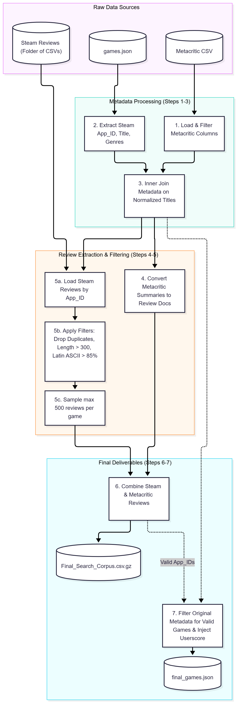
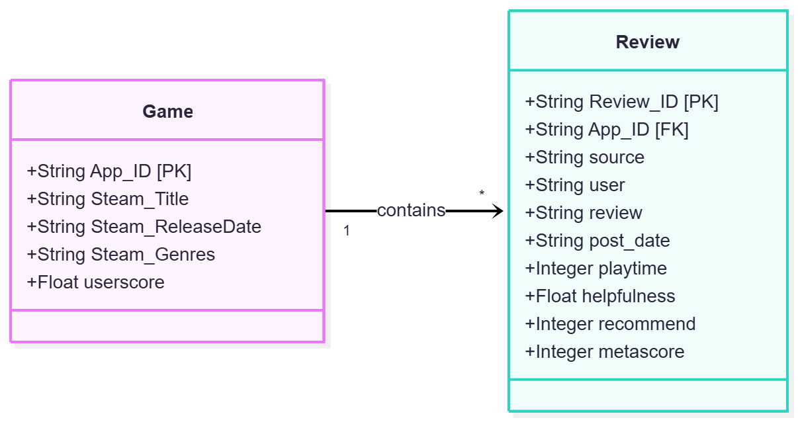

# Information Processing and Retrieval (PRI) - Project

**Course:** Master in Informatics Engineering and Computation (M.EIC), FEUP U.Porto

**Milestone 1:** Data Preparation

The pipeline combines structured game metadata with unstructured textual reviews from two distinct data sources: Steam and Metacritic.

## Data Processing Pipeline

The data extraction and preparation process is fully automated. It normalizes game titles to find overlapping datasets, standardizes date formats, and aggressively filters raw Steam reviews to build a high-quality corpus for indexing.

### Filtering & Quality Control

To ensure the final dataset is rich in meaningful textual data and suitable for text-based ad-hoc retrieval, the following filters are applied to the raw Steam reviews:

* **Deduplication:** Removes exact duplicate reviews to prevent spam and biased weightings.
* **Length Threshold:** Drops any review with fewer than 300 characters, ensuring documents have enough semantic density for indexing.
* **Language & Encoding Verification:** Evaluates the character composition, requiring at least 85% of the text to be standard Latin ASCII (a-z, 0-9). This effectively filters out non-English reviews (e.g., Cyrillic, Asian characters) and corrupted encodings.
* **Data Sampling:** Limits Steam reviews to a maximum of 500 per game to manage storage footprint and indexing time while maintaining a large, diverse dataset.
* **Metacritic Curation:** Extracts the Metacritic summaries and injects them as distinct review documents.




## Conceptual Domain Model

The conceptual model centers on a **One-to-Many (1-to-N)** relationship between the physical games and their associated textual reviews.

Both Steam user reviews and Metacritic critical summaries share the `Review` schema. The `source` attribute tracks the origin, allowing for distinct retrieval strategies and query boosting in future milestones.

## Repository Structure & Prerequisites

To run this pipeline, ensure your directory is structured as follows:

```text
/
├── parser.py                                  # Main pipeline script
├── dataset_metacritic_scraper_2025-02-15.csv  # Metacritic dataset
├── games.json                                 # Steam metadata dataset
└── Games Reviews/
    └── Games Reviews/                         # Uncompressed Steam reviews folder
        ├── 10_123.csv
        ├── 20_456.csv
        └── ...

```

**Requirements:**

* Python 3.x
* Pandas (`pip install pandas`)

## Usage

Run the data merging script via the command line:

```bash
python parser.py

```

## Generated Outputs

Executing the script will generate two optimized deliverables for Milestone 2:

1. **`Final_Search_Corpus.csv.gz`**: A GZIP-compressed CSV file containing all filtered unstructured textual reviews and their specific metrics (playtime, helpfulness, metascore, source). Compressed to adhere to storage limits while maintaining thousands of textual documents.
2. **`final_games.json`**: A lightweight JSON file containing only the structured metadata (Title, Release Date, Genres, Userscore) for the specific games that successfully passed through the filtering pipeline.

The final dataset includes 500,105 steam reviews (of a total of 12,526,280 available in the original dataset) and 1,787 Metacritic reviews. Due to its sheer size, he have divided Final_Search_Corpus.csv.gz into 3 files, so as to allow their usage in the github environment.

## Datasets & Provenance

This project integrates two distinct datasets to satisfy the requirement of combining structured data with unstructured, rich textual fields.

1. **Steam Reviews Dataset**
   * **Source:** [Mendeley Data - Steam Reviews](https://data.mendeley.com/datasets/jxy85cr3th/2)
   * **Description:** Provides extensive user reviews, playtime metrics, and helpfulness votes from the Steam platform. This serves as our primary source of unstructured textual data for indexing.
   * **Files Used:** `games.json` (metadata) and the nested CSV review files.

2. **Metacritic Games Scrape**
   * **Source:** [Kaggle - Metacritic Games Scrape](https://www.kaggle.com/datasets/zaireali/metacritic-games-scrape)
   * **Description:** Contains structured critical reception data, release dates, and professional summaries for video games.
   * **Files Used:** `dataset_metacritic_scraper_2025-02-15.csv`.